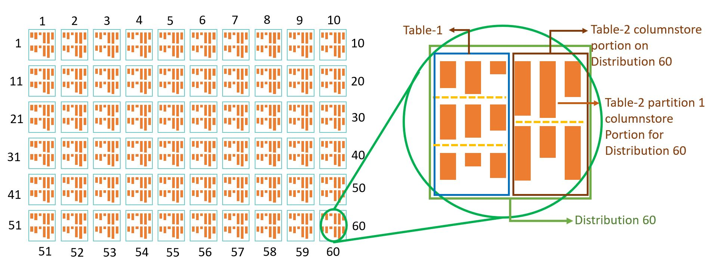
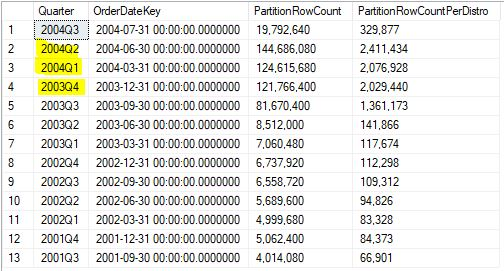
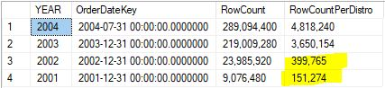
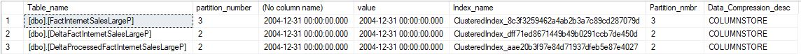

# Partition Implementation Samples

Partitioning in Azure Synapse SQL Pools is a very powerful feature yet also dangerous if misused or misunderstood.
We need to design our partitioning schema on one simple fact, which is :["A healthy compressed row group should contain 1M rows"](https://docs.microsoft.com/en-us/azure/synapse-analytics/sql/develop-best-practices#optimize-clustered-columnstore-tables) 

If we have a very evenly distributed table, which has around same number of rows per each of its 60 distributions, to understand whether the table is suitable for partitioning, we should estimate the size of each partition portion row size per distribution  and have it be more than 1 Million rows, as shared in the [best practices guideline of Azure Synapse SQL Pools Partitioning Documentation](https://docs.microsoft.com/en-us/azure/synapse-analytics/sql/develop-best-practices#do-not-over-partition)

In below figure illustrates how a partitioned table stores its partitions in distributions. For a specific table every distribution may have a portion of the partition data. If the partition data for that specific distribution is not close to 1 million rows, the row group quality for that partition will be lower.

[](#)


Therefore understanding/estimating how your data distributes by distribution and partition key is the number one step for examining partitioning options.
You should keep in mid that you will have at least **Number of Partitions** * **60** rowgroups, and each should be around  1 million rows.

Another important aspect of selecting a proper partition key is knowing/understanding how your data is read or written. If your data is loaded incrementally by a specific key, and also this key is used for read filtering for the table, that columns can be a good candidate for partitioning.

Our test table is an enlarged version with fewer keys of the FactInternetSales  from AdventureWorksDW, which we call  whose rowcount is   541 million.

Below you can find the non-partition table script.

```sql
CREATE TABLE [dbo].[FactInternetSales]
(
    [ProductKey]            int          NOT NULL
,   [OrderDateKey]          datetime2(7) NOT NULL
,   [CustomerKey]           int          NOT NULL
,   [PromotionKey]          int          NOT NULL
,   [SalesOrderNumber]      nvarchar(20) NOT NULL
,   [OrderQuantity]         smallage     NOT NULL
,   [UnitPrice]             money        NOT NULL
,   [SalesAmount]           money        NOT NULL
)
WITH
(   CLUSTERED COLUMNSTORE INDEX
,   DISTRIBUTION = HASH([ProductKey])
)
;
```

In our Scenario, the data on FactInternetSales is incrementally growing by OrderDateKey and usually queried by in combinations of OrderDateKey and ProductKey.

## Step 1 Exploring the data to find best partitioning approach:
The first approach should be checking various versions of partition key usage and understand how the data distributes. On our case we will look at how the data looks like for monthly, quarterly and yearly distributions:

**Monthly**
```sql
select  format(OrderDateKey,'yyyyMM') [MONTH],
        max(OrderDateKey) OrderDateKey,FORMAT(count_big(*),'#,#') PartitionRowCount,
	      FORMAT(FLOOR(count_big(*) /60),'#,#') PartitionRowCountPerDistro 
from dbo.FactInternetSalesLarge
group by format(OrderDateKey,'yyyyMM') order by format(OrderDateKey,'yyyyMM') desc
```

 **Quarter**
```sql
select  cast(DATEPART(YEAR, CAST(OrderDateKey as date)) as varchar)+'Q'+cast(DATEPART(QUARTER, CAST(OrderDateKey as date))as varchar) as [Quarter],
	      max(OrderDateKey) OrderDateKey,
        FORMAT(count_big(*),'#,#') PartitionRowCount,
        FORMAT(FLOOR(count_big(*) /60),'#,#') PartitionRowCountPerDistro 
from dbo.FactInternetSalesLarge
group by  cast(DATEPART(YEAR, CAST(OrderDateKey as date)) as varchar)+'Q'+cast(DATEPART(QUARTER, CAST(OrderDateKey as date))as varchar) order by 1 desc
```

 **Year**
 ```sql
   select DATEPART(YEAR, CAST(OrderDateKey as date))  as [YEAR],
          max(OrderDateKey) OrderDateKey,
          FORMAT(count_big(*),'#,#') PartitionRowCount,
		      FORMAT(FLOOR(count_big(*) /60),'#,#') PartitionRowCountPerDistro 
   from dbo.FactInternetSalesLarge
 group by  DATEPART(YEAR, CAST(OrderDateKey as date))  order by 1 desc
```

*Some of your history may have different number of rows so you may want to group your earlier data differently.*
Lets examine the results of quarterly and yearly *(I am not sh owing monthly since it has a longer output data)*.

Below you can see the output of the Quarterly examination query:

*It can be seen that only 2004Q1,2004Q2,2003Q3 future partitions highlighted with yellow has enough data to have relatively healthy compressed  row groups. But 2003Q2 and earlier data should not be designed as individual partitions but more of a merging approach should be used unless we do not have any technical reasons requiring us to do that.For 2004Q3 we assume that more future data will come. And a later in this document will be explained kind of logic will be implemented to maintain health compressed rowgroups.*

[](#)


Below you can see the output of the Yearly examination query:

*It can be seen that only 2004,2003 future partitions highlighted with yellow has enough data to have relatively healthy compressed  row groups. 2002 and 2001 can be either merged with 2003 or  kept together as a 2002&2001 combined partition to help in queries targeting 2003 with [partition pruning](https://docs.microsoft.com/en-us/azure/synapse-analytics/sql-data-warehouse/sql-data-warehouse-tables-partition#benefits-to-queries).*

[](#)

## Step 2: Creating partitioned table script:
The second most important thing on partitioning is deciding the range direction.
If the table will always receive an incremental future data, having an inclusive upper boundary can help with maintenance, therefore to be able to add partitions in the future easily,
adding a "HIGH-DATE" partition ("9999-12-31","4999-12-31" etc.) **RANGE LEFT** option that will always be ready and empty for future future splits and addition requirements, will be useful. 

*For lower bounded partitioning examples  **RANGE RIGHT** option should be used. More details on  how to use **RANGE RIGHT**  you can refer to [this example](https://docs.microsoft.com/en-us/azure/synapse-analytics/sql-data-warehouse/sql-data-warehouse-tables-partition#partition-switching) on Microsoft Azure Docs.*


Lets create our partitioned table from our non partitioned table:
```sql
CREATE TABLE [dbo].[FactInternetSalesLargeP]
WITH
(   CLUSTERED COLUMNSTORE INDEX
,   DISTRIBUTION = HASH([ProductKey])
,   PARTITION   (   OrderDateKey RANGE LEFT FOR VALUES
                   ('9999-12-31','2004-12-31' , '2003-12-31' , '2002-12-31')
		)
)
as
select * 
 from dbo.FactInternetSalesLarge
;
```
## Step 3: maintaining a partitioned table:
Lets say you have some inserted and some updated data for year 2004, and you processed that changes via joining the new data with the old data and created a new table called **dbo.DeltaProcessedFactInternetSalesLargeP** how are you going to replace the old data of the partition with the new one?

Partition range values and partition numbers are important in maintaining partitions.
You can switch a partition's data with another table's similarly ranged partition by using **Partition Number** information
You can check how many partitions are created,  the range value of a partition, or  fetch the partition number of a partition whose range value you know with below query:

```sql
SELECT 
	sch.name+'.'+tbl.name as Table_name,
	prt.[partition_number],
	rng.[value]	,
	idx.[name] as Index_name,
	prt.partition_number as Partition_nmbr,
	 prt.[data_compression_desc] as Data_Compression_desc
FROM   sys.schemas sch
	INNER JOIN sys.tables tbl    ON  sch.schema_id       = tbl.schema_id
	INNER JOIN sys.partitions prt    ON  prt.[object_id]     = tbl.[object_id]
	INNER JOIN sys.indexes idx   ON  prt.[object_id]     = idx.[object_id] AND prt.[index_id] = idx.[index_id]
	INNER JOIN sys.data_spaces               ds  ON  idx.[data_space_id] = ds.[data_space_id]                       
	INNER JOIN sys.partition_schemes     ps  ON  ds.[data_space_id]  = ps.[data_space_id]                
	INNER JOIN sys.partition_functions       pf  ON  ps.[function_id]    = pf.[function_id]              
	LEFT JOIN sys.partition_range_values rng ON  pf.[function_id]    = rng.[function_id] AND rng.[boundary_id] = prt.[partition_number]    
WHERE   tbl.name = 'FactInternetSalesLargeP' 
   and  sch.name = 'dbo'
    and cast(cast(rng.[value] as varchar) as datetime2)= convert(datetime2,'2004-12-31',23);
```


**Partition Number** information is used for changing the old data with the new one via a very useful operation called [**PARTITION SWITCHING**](https://docs.microsoft.com/en-us/azure/synapse-analytics/sql-data-warehouse/sql-data-warehouse-tables-partition#partition-switching)

Another important thing to be careful about is all columns of both tables needs to be in the same order, same data type and have same nullability attribute/constrains per column.

once we execute above query with

```sql
 tbl.name like '%FactInternetSalesLargeP' 
```
for our data we receive below result:

[](#)

According to above result, with below command we will be switching Partition 2 of DeltaProcessedFactInternetSalesLargeP to partition 3 of FactInternetSalesLargeP with purging/truncating the destinations data. If we do not set WITH (TRUNCATE_TARGET = ON) you will have an error since the target partition still contains data.

```sql
ALTER TABLE dbo.DeltaProcessedFactInternetSalesLargeP SWITCH  PARTITION 2 to dbo.FactInternetSalesLargeP  PARTITION 3 WITH (TRUNCATE_TARGET = ON)--00:01
```
## Step 4 : adding a non existing new partition:

Lets say we need to add 2005 data to our beloved [dbo].[FactInternetSalesLargeP] table. to do that we need to split the last existing partition into two. you can not split a partition which has data without emptying it. HEre we see the benefits of both picking RANGE LEFT and adding a HIGH DATE partition.

since our high date partition is always empty, we can easily split it for a new range. You should keep in mind, the new partitions value should be in between the HIGH DATE partition and the last partition.
```sql
ALTER TABLE [dbo].[FactInternetSalesLargeP] SPLIT RANGE ('2005-12-31');
```
Working with partitions are easy if you keep in mind the basic principles.

1. Try to have number of partitions that will keep your row groups healthy
2. Keep in mind your load process.
3. Be careful with column order, data types, constrains, all should be the same.
4. Pick the correct range approach for correct reasons. RANGE LEFT with HIGH DATE partition can make a lot of things easier if you do not receive early records.
